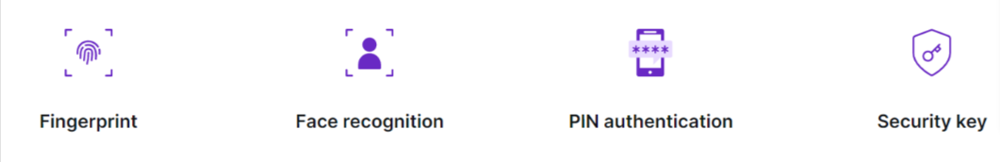
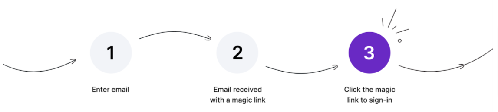

---
title: "How Secure Is Passwordless Authentication for Businesses?"
date: 2022-10-04 T13:33:58+05:30
coverImage: ""
author: "Archna Dhaka"
tags: ["Article"]
description: ""

When it comes to authentication, many businesses are in the process of going fully passwordless or laying out a plan. Tech giants like Microsoft, Google, and Apple have made remarkable progress in going passwordless. However, whether passwordless authentication is secure remains a prevalent question in leaders' minds when deciding whether to go passwordless or not.

This article will talk about two important passwordless authentication security-related questions:

* How secure is passwordless authentication to use?
* What are the secure passwordless authentication methods?

## What is Passwordless Authentication?
Passwordless authentication is the process of authenticating a user without the need for a password. With this, the user has to provide some information that is known only to them and the system, which can be used to identify them. 
Biometric authentication is an example of passwordless authentication, while Magic Links and OTPs are examples of semi-passwordless authentication.

## Is passwordless authentication secure to use?
Compared to password-based authentication, passwordless authentication is less prone to common cyber attacks and harder to crack. However, it would be best if you do not assume that passwordless authentication is entirely safe from hackers and cyber attacks, as no authentication system is 100% secure.

Here are the common cyber attacks against which passwordless authentication provides protection:

* Bruteforce attack
* Dictionary attack
* Rainbow attack
* Credential stuffing
* Phishing 
* Keylogging

Also, passwordless authentication such as biometric provides next-level data protection and security by acting upon on-device user authentication cycle with a privacy-friendly mechanism, i.e., the authentication is performed on-device and the private information necessary for authentication is securely stored only on the user’s device and not transmitted over the internet.

Passwordless authentication effectively checks the security box against password authentication. Now, let’s see the common passwordless authentication methods with their benefits and limitations.

## What are the secure passwordless authentication methods?
### WebAuthn (Biometric and Security Keys) Authentication 

WebAuthn (Web Authentication API) is a specification that allows servers to register and authenticate users using public key cryptography instead of a password. It allows web applications to simplify and secure user authentication by using registered devices such as phones, security keys, and laptops as factors. 

Biometric authentication, such as fingerprint authentication, facial recognition, and retina scan are facilitated using WebAuthn. In addition, authentication using the security (hardware) keys and a combination of security keys with biometrics are also facilitated using WebAuthn. 

It provides users with fast and smoother login experiences and saves costs for business by eliminating the need for password management support. Read more about its benefits and how to implement it [here](https://mojoauth.com/products/webauthn/).

**Important:** Biometric data is not transferred to or stored in the Web Server. It remains with the authenticator device that belongs to users. 

**How WebAuthn works during user registration:**

User visits web application and proceeds with the registration.
Web server generates a challenge key for registration and sends it to the web application along with user information.
Web application adds the authoritative domain name to information and sent to the authenticator.
[Authenticator](https://w3c.github.io/webauthn/#authenticator) presents a message for user biometrics (a form of consent).
Once consent is given, the authenticator stores Public/Private Key, User info, and Domain name along with credential id.
Web application sends the Public Key along with additional information such as attestation regarding the provenance and characteristics of the authenticator.
Web server stores the Public Key and associates it with the user.

**How WebAuthn works during user authentication/login:**

User initiates login.
Web server sends a unique challenge to the registered authenticator.
Authenticator asks and receives biometrics from the user.
Authenticator generates a cryptographic signature using the private key and sends it to the web server.
Web server verifies the cryptographic signature against the unique challenge originally sent.
User logs in upon successful verification.

WebAuthn is a highly secure and convenient to use passwordless authentication method.

### Magic Link Authentication
Magic links are one-time use links sent to the user during the authentication process. Magic links contain a token and a hash function. Also, the magic links are time-bound and then auto-expire, regardless of whether they are used. Read more about its benefits and how to implement it [here](https://mojoauth.com/products/email-magic-link/).

The authentication process with Magic Link looks like the following:

User enters an email address or username.
Magic link is sent to the user’s email address.
User clicks the magic link to access their application account.

Magic links are easy to use and certainly more secure than password-based authentication. However, they are not immune to man-in-middle attacks if the user is on an unencrypted network. 
### OTP Authentication
OTPs are one-time use passcodes sent to users during the authentication process. Businesses can utilize OTP authentication in one of the following ways as per their use cases:

* **Email OTP Authentication:** Authenticate the user using an OTP sent to the user's email address. Read more about its benefits and how to implement it [here](https://mojoauth.com/products/email-otp/).
* **SMS OTP Authentication:** Authenticate the user using an OTP sent to the user’s phone number via SMS. Read more about its benefits and how to implement it [here](https://mojoauth.com/products/sms-authentication/).

The authentication process with OTP looks like the following:

User enters the email address or phone number.
OTP is sent to the user’s email address or phone number.
Upon receiving the OTP, user enters the OTP on the authentication screen.

OTP Authentication is convenient to use and secure against most password-based attacks. However, cybercriminals can compromise OTPs using SIM swap attacks. 

Now that we have discussed the most prevalent questions, let’s see how businesses can implement passwordless authentication.

## Benefits of Passwordless Authentication
There are many benefits of a passwordless authentication system, including that passwords are not needed, which makes it easier for users to log in and share their devices with other people without having to worry about someone else accessing their accounts.
* Protection Against Password-based Attacks 
* Improved User Experience
* Eliminates Password-related Business Expenses 
## How to implement passwordless authentication?
After deciding to go passwordless, the next big question for businesses is whether to build a passwordless authentication solution in-house or use the ones already available in the market. 

Here is a quick **Build v/s Buy** comparison for you:

Building passwordless authentication from scratch is costly and prone to failure. Since the investment in developing in-house is high, the return to investment ratio is also lower when compared to using an already available solution in the market.

Buying passwordless authentication allows businesses to deploy passwordless solutions as per their requirements quickly. Also, businesses can effectively scale the purchased passwordless authentication solution when the scaling requirement arises without investing in scaling at the initial stage.

Overall, buying and deploying a passwordless authentication solution based on business needs appears to be a better fit for most businesses.

## Conclusion: Securely Going Passwordless for Businesses 
It is safe to conclude that passwordless authentication is way safer when compared to password authentication. Thus, moving away from password authentication has become a necessity rather than a choice.

However, getting rid of password authentication is not a one-go job. Businesses must plan and execute the password on various individual levels. For example, businesses must examine whether the target audience is educated to use passwordless authentication and do they have software and hardware requirements fulfilled (in case of choosing biometric authentication).

If you are an existing business and going passwordless, think about your users or employees who have been using passwords so far. The process of going passwordless for them should be gradual, and the first step can be providing them with both authentication options- password and passwordless. To start your passwordless journey, [forever free sign up](https://mojoauth.com/dashboard/signin) for the MojoAuth and see how easy it is to implement passwordless authentication for your business.

